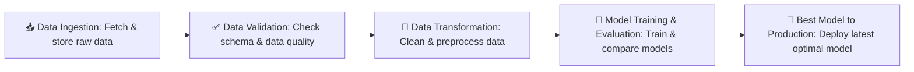

## Taxi/Ride-share Demand Forecasting & Supply Optimization for OrionCabs

[Link to Live Project](https://taxi-demand-forecast-9wmwrc6fz8ma4v8ay4285r.streamlit.app/)

[Link to DagsHub Repository](https://dagshub.com/AnupamKNN/taxi-demand-forecast)

[Link to Presentation Video](https://youtu.be/biS83GinVEE)

[Link to LinkedIn post](https://www.linkedin.com/posts/anupam-singh-1l_genai-ai-machinelearning-activity-7373696950585556992-gJz7?utm_source=share&utm_medium=member_desktop&rcm=ACoAACTx8xsBG5OdxDsxposmyvR-JD_HZhoD33I)


---

### 🏢 About the Company

**OrionCabs** is a next-generation urban mobility platform committed to redefining the way people move in metropolitan cities. Designed to meet the transportation needs of fast-paced urban lifestyles, OrionCab provides reliable, affordable, and safe rides across business districts, residential neighborhoods, airports, and transit hubs.

With millions of trips completed monthly, OrionCab has become an integral part of city infrastructure, helping passengers reach their destinations efficiently while enabling drivers to maximize their earnings.

The company’s mission goes beyond ride-hailing — it focuses on creating a sustainable mobility ecosystem by:

- Reducing passenger wait times through intelligent demand forecasting and dynamic driver allocation.

- Enhancing driver earnings with optimized pricing models and fair incentive structures.

- Improving fleet utilization via real-time data insights and predictive algorithms.

- Supporting sustainability goals by promoting electric vehicles (EVs) and shared mobility initiatives.


OrionCab’s core philosophy revolves around data-driven operations — leveraging AI, predictive analytics, and automation to balance supply and demand, reduce inefficiencies, and create seamless travel experiences for both riders and drivers.

---

### 👥 Project Stakeholders and Team

| Role                                             | Name             | Responsibility                                                          |
| ------------------------------------------------ | ---------------- | ----------------------------------------------------------------------- |
| **Chief Operating Officer (Stakeholder)**        | **Rahul Mehta**  | Defined operational KPIs, SLAs, and dispatch policies                   |
| **Director of Dispatch Analytics (Stakeholder)** | **Vikram Iyer**  | Provided domain signals, demand surge patterns, and evaluation criteria |
| **Program Manager**                              | **Rajat Kapoor** | Drove timelines, risk management, cross-team coordination               |
| **Lead Data Scientist**                          | **Anupam Singh** | Problem framing, feature engineering, deep learning model design        |
| **Machine Learning Engineer (MLOps)**            | **Priya Nair**   | CI/CD, model registry, experiment tracking, Dockerization               |
| **Frontend Developer**                           | **Aman Khanna**  | Streamlit app UX, what-if analysis, report export                       |
| **Data Platform Engineer**                       | **Simran Kaur**  | Data ingestion, historical store, pipeline reliability                  |


---

### 📉 Business Problem

Demand for rides varies sharply by **hour, zone, weather, events, and holidays**. Without accurate forecasts, operators face:

* **Under‑supply** → long waits, missed trips, churn
* **Over‑supply** → idle time, fuel waste, lower driver earnings
* **Reactive pricing** instead of planned incentives
* **Inequitable service** across zones and time windows

This project builds a **predictive & prescriptive** layer that anticipates demand and recommends driver placement to keep **supply‑demand balanced**.

---

### 🎯 Project Objectives

* Predict **hourly ride demand** per pickup zone (spatio‑temporal).
* Surface **drivers‑to‑deploy** recommendations for hot zones.
* Flag **upcoming surges/shortages** with alerting hooks.
* Provide **explainable insights** (LLM‑assisted) for non‑technical teams.
* Offer a **clean, self‑serve Streamlit UI** for operations.


---

### 🧰 Tech Stack

| **Category**                     | **Tools & Libraries**                                                                                                                                                                                                                                                                                        |
| -------------------------------- | ------------------------------------------------------------------------------------------------------------------------------------------------------------------------------------------------------------------------------------------------------------------------------------------------------------ |
| **Language**                     | Python 3.10                                                                                                                                                                                                                                                                                                  |
| **ML/DL Frameworks**             | TensorFlow (GPU-ready), Keras Tuner (for Hyperparameter Optimization)                                                                                                                                                                                                                                        |
| **Data Processing**              | Pandas, NumPy                                                                                                                                                                                                                                                                                                |
| **Visualization**                | Matplotlib, Seaborn                                                                                                                                                                                                                                                                                          |
| **MLOps & Performance Tracking** | MLflow (experiment tracking), DVC (data & model versioning)                                                                                                                                                                                                                                                  |
| **Deployment**                   | Streamlit                                                                                                                                                                                                                                                                                                    |
| **Data Sources**                 | [Weather Data](https://archive-api.open-meteo.com/v1/archive?latitude=40.7128&longitude=-74.0060&start_date=2025-01-01&end_date=2025-04-30&hourly=temperature_2m,precipitation,weathercode&timezone=America/New_York), [Yellow Taxi Trip Data](https://www.nyc.gov/site/tlc/about/tlc-trip-record-data.page) |
| **CI/CD Pipelines**              | GitHub Actions                                                                                                                                                                                                                                                                                               |
| **Containerization**             | Docker, GitHub Container Registry (GHCR)                                                                                                                                                                                                                                                                     |
| **LLM Assist**                   | LangChain + ChatGroq (model: `meta-llama/llama-4-scout-17b-16e-instruct`) |


---

### 🖥️ Streamlit Dashboard Features

* **📍 Inputs sidebar**: Pickup location (NYC TLC `PULocationID` mapping), date & hour (America/New\_York), weather, holiday, rain, temperature, precipitation
* **🧩 Auto target‑derived features**: Lags (1/24/168), 3‑hour rolling mean & std computed from historical data (`HIST_PATH`)
* **🤖 Predict button**: Runs `preprocessor.pkl` + `model.keras` for an hourly demand estimate
* **🔎 “Why this prediction?”**: LLM‑generated explanation in plain language
* **🔮 What‑if Scenario Analysis**: Natural‑Language counterfactuals (e.g., *“What if it rains at 9 pm?”*)
* **📋 Show input features**: View the exact row that feeds the model
* **🧾 PDF export**: One‑click **Analysis Report** for ops (LLM‑authored, styled headings)
* **💬 Ask the assistant**: Q\&A about inputs/definitions, grounded in a historical data summary


---

### ⚙️ Setup & Run

#### Option 1 — Run with Docker (Recommended)

**Prerequisites:**

* Make sure you have [Docker Desktop](https://www.docker.com/products/docker-desktop/) installed on your system.

> **For contributors/maintainers:** If the repository is private, authenticate with GHCR using:
> ```bash
> docker login ghcr.io
> ```
> Use a GitHub Personal Access Token for authentication.

**Steps:**

1.  **Pull the Docker Image:**
 The Docker image is pre-built and pushed to GitHub Container Registry (GHCR). Pull it directly:
  ```bash
  docker pull ghcr.io/anupamknn/taxi-demand-forecast:latest
  ```

**Or build locally from source:**

  ```bash
  git clone https://github.com/AnupamKNN/taxi_demand_forecast.git
  cd taxi_demand_forecast
  
  docker build -t taxi-demand_forecast:latest
  ```

2.  **Run the Docker Container:**
Once the image is pulled, you can run the application. The container will listen on map port `8502` on your local machine (adjust if your app uses a different port).
  ```bash
  docker run -p 8502:8502 ghcr.io/anupamknn/taxi-demand-forecast:latest
  ```

3.  **Access the Application:**
Navigate to [http://localhost:8502](http://localhost:8502) in your web browser to access the Streamlit dashboard.


> Ensure `final_models/model.keras`, `final_models/preprocessor.pkl`, and the historical data file at `final_models` and `templates\historical_data` respectively, are available inside the container (volume‑mounted as shown).


#### Option 2 — Manual Local Setup (For Development)

If a manual setup is preferred, follow these steps:

**Prerequisites:**

* **Python 3.11** or higher installed.

1.  **Clone the Repository:**
  ```bash
  git clone https://github.com/AnupamKNN/taxi-demand-forecast.git
  ```

2. *** Locate to the project folder:***
  ```bash
  cd taxi_demand_forecast
  ```

3. **Create a Virtual Environment and Install Dependencies:**

 **Using `venv` (recommended for Python projects):**

#### 1️⃣ Create a virtual environment
  
    ```bash
    python3.11 -m venv venv
    ```

#### 2️⃣ Activate the virtual environment

##### For Linux/macOS:
    ```bash
    source venv/bin/activate
    ```

##### For Windows (PowerShell):
    ```bash
    .\venv\Scripts\Activate.ps1
    ```

##### For Windows (Command Prompt):
    ```bash
    .\venv\Scripts\activate
    ```

#### 3️⃣ Install dependencies
    ```bash
    pip install -r requirements.txt
    ```

4) **Configure environment**
cp .env.example .env
### 🔑 Environment Variables  

After copying `.env.example` to `.env`, edit the file and set the required keys:  

- `GROQ_API_KEY=<your_key>`  
- `LANGCHAIN_API_KEY=<your_key>`  
- `MLFLOW_TRACKING_USERNAME=<your_username>`  
- `MLFLOW_TRACKING_PASSWORD=<your_password>`  
- `MLFLOW_TRACKING_URI=<your_tracking_uri>`  

> **Note:** MLflow credentials are only required for developers or contributors who need experiment tracking.

5) **Ensure artifacts & data exist**
- final_models/model.keras
- final_models/preprocessor.pkl
- templates/config.py has valid HIST_PATH pointing to historical CSV

6) **Run the app**
streamlit run app.py

### Explanation:
1. Creates a Conda virtual environment** named `venv` with Python 3.10.
2. Activates the environment.
3. Installs dependencies from the `requirements.txt` file.  

This makes it easy for anyone cloning your repo to set up their environment correctly! ✅

---


### 🔬 Model Training & Evaluation

The predictive model was built using **TensorFlow** with **embedding layers** for high-cardinality categorical features.

**Training workflow included:**

1. **Feature Engineering**

   * Ordinal encoding for categorical variables
   * Standard scaling for numerical features
   * Transformation pipeline persisted for reproducibility

2. **Model Architecture**

   * Embedding layers for categorical features
   * Dense layers with **ReLU activations**
   * Single regression output node for ride demand prediction

3. **Hyperparameter Optimization (HPO)**

   * Conducted with **Keras Tuner (RandomSearch)**
   * Parameters tuned: embedding dimensions, dense units, dropout rate, learning rate
   * Best configuration selected based on validation performance logged in **MLflow**

4. **Training Setup**

   * Batch size: **1024**
   * Epochs: \~10 (final model retrained on full dataset with best hyperparameters)

5. **Model Pusher Output**

   * Trained Model: `final_models/model.keras`
   * Preprocessor: `final_models/preprocessor.pkl`


#### 📊 Evaluation Metrics

We report standard regression metrics on a holdout set:

- **MAE** (Mean Absolute Error)
- **MSE** (Mean Squared Error)
- **RMSE** (Root Mean Squared Error)
- **R²** (Coefficient of Determination)

---

### 🧪 Model Performance Summary

#### 🔍 Before Hyperparameter Tuning / Hyperparameter Optimization (HPO)

| **Metric**                         | **Value**                                             |
| ---------------------------------- | ----------------------------------------------------- |
| **Mean Absolute Error (MAE)**      | `6.388235697783471`                                   |
| **Mean Squared Error (MSE)**       | `224.59190932589152`                                  |
| **Root Mean Squared Error (RMSE)** | `14.986390803855727`                                  |
| **R-squared (R²)**                 | `0.9600288264465625`  (**96.00% variance explained**) |


#### 🚀 After Hyperparameter Tuning / Hyperparameter Optimization (HPO)

| **Metric**                         | **Value**                                            |
| ---------------------------------- | ---------------------------------------------------- |
| **Mean Absolute Error (MAE)**      | `5.554043769836426`                                  |
| **Mean Squared Error (MSE)**       | `157.80723571777344`                                 |
| **Root Mean Squared Error (RMSE)** | `12.56213499838994`                                  |
| **R-squared (R²)**                 | `0.9719146490097046` (**97.19% variance explained**) |


> HPO materially improves all error metrics and increases explained variance. The tuned model is promoted to production.

---

## 🏭 Production‑Ready Pipeline

| **Script**               | **Purpose**                               | **Key Operations / Output**                                                                       |
| ------------------------ | ----------------------------------------- | ------------------------------------------------------------------------------------------------- |
| `data_ingestion.py`      | Pulls raw trip & weather data             | Computes lags, rolling stats, joins calendar & weather data; writes curated parquet/CSV           |
| `data_validation.py`     | Ensures data quality                      | Validates schema, checks integrity, detects anomalies                                             |
| `data_transformation.py` | Prepares data for modeling                | Preprocesses & transforms features; saves preprocessor object for production                      |
| `model_trainer.py`       | Trains and evaluates the predictive model | Performs hyperparameter tuning (Keras Tuner), evaluates metrics, logs to MLflow, saves best model |


> **Note:** The pipeline is designed to automatically deliver the best‑performing model from the latest run based on evaluation metrics, ensuring that production always uses the most optimal version.

### Pipeline Flow



---

### 🕹️ Usage (in App)

1. **Select inputs** in the sidebar: location, date, hour, weather, holiday/rain, temperature, precipitation.
2. Click **Predict 🚕** to generate the hourly ride estimate.
3. Open **Why this prediction?** to read an LLM‑crafted, non‑technical explanation.
4. Try **What‑If Scenario Analysis** (e.g., “What if it rains at 9 PM?”) and compare guidance.
5. Use **Show input features** to audit the exact row sent to the model.
6. **Export Analysis Report** as **PDF** for shift planning / dispatch briefings.
7. **Ask the assistant** to clarify inputs and domain terms using historical context and project documentation.

---

### 🔥 Results & Insights

* Clear **AM (7–9)** and **PM (6–9)** peak bands across business & transit zones
* **Weather** (rain/snow) elevates demand in certain zones; **holidays** alter typical weekday patterns
* Temporal features (`lag_24`, `lag_168`) capture daily/weekly seasonality; recent **rolling stats** stabilize volatility
* Tuned TF model achieves **low RMSE** and **high R²**, supporting reliable deployment for planning

---

### 📈 Impact

| Metric                   | Projected Outcome                         |
| ------------------------ | ----------------------------------------- |
| 🔻 Passenger Wait Time   | 15–25% reduction via proactive deployment |
| 🔺 Driver Utilization    | 10–20% improvement during peak windows    |
| 🔁 Missed/Declined Trips | 12–18% reduction in hot zones             |
| 💸 Incentive Efficiency  | Plan surges/bonuses with less waste       |
| 📈 Forecast Accuracy     | High R² with low RMSE on holdout periods  |

---

### ✅ Final Deliverables

| **Deliverable**              | **Purpose & Key Components**                                                                                                  |
| ---------------------------- | ----------------------------------------------------------------------------------------------------------------------------- |
| 📦 **Training Pipeline**     | End-to-end, reproducible scripts covering **data ingestion → validation → feature engineering → model training & evaluation** |
| 🧮 **Feature Engineering**   | Creates **target-derived temporal features** and enriches with **calendar & weather data**                                    |
| 🏷️ **Model Artifacts**      | Saved outputs: `final_models/model.keras` (trained model), `final_models/preprocessor.pkl` (preprocessor object)              |
| 📊 **Tracking & Versioning** | **MLflow** for experiment tracking, **DVC** for versioning data, models, and preprocessing pipelines                          |
| 🖥️ **Streamlit Dashboard**  | Provides **single-prediction UI**, **LLM-powered explanations**, **what-if analysis**, and **PDF export**                     |
| 🔧 **CI/CD + Docker**        | **GitHub Actions** workflows, Docker container image for reproducible runtime and deployment                                  |


---

### 💡 Enjoyed this project?

If this repository helped you, consider:

* ⭐ **Starring** the repo — helps others find it
* 🍴 **Forking** it — adapt to your city & data
* 🐛 **Opening issues** — suggest features or report bugs

---


### Notes & Conventions

* **Timezone:** All predictions localized to **America/New\_York**
* **Mappings:** `LOCATION_DICT`, `WEATHER_DICT` in `templates/config.py`
* **Security:** Keep `GROQ_API_KEY`, `LANGCHAIN_API_KEY=<your_key>`, `MLFLOW_TRACKING_USERNAME=<your_username>`, `MLFLOW_TRACKING_PASSWORD=<your_password>` &`MLFLOW_TRACKING_URI=<your_tracking_uri>`  in `.env` (LLM features are optional)
* **Reproducibility:** Lock versions in `requirements.txt`; track runs with MLflow

[](https://github.com/anupamknn/taxi-demand-forecasts)
